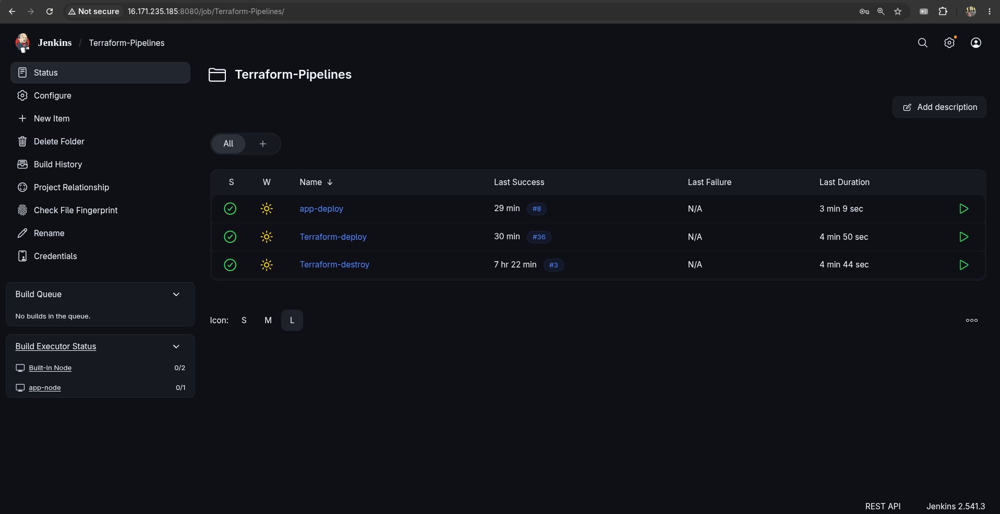

# AWS Infrastructure CI/CD Pipeline

A fully automated AWS infrastructure provisioning and application deployment system built with Terraform, Jenkins, and Ansible. The project provisions a complete AWS environment including networking, compute, database, caching, and load balancing — all managed through Jenkins CI/CD pipelines.

---

## Table of Contents

- [Architecture Overview](#architecture-overview)
- [Project Structure](#project-structure)
- [Infrastructure Components](#infrastructure-components)
- [Prerequisites](#prerequisites)
- [Setup Guide](#setup-guide)
  - [Step 1: Bootstrap Jenkins Server](#step-1-bootstrap-jenkins-server)
  - [Step 2: Configure Jenkins](#step-2-configure-jenkins)
  - [Step 3: Create Pipeline Jobs](#step-3-create-pipeline-jobs)
  - [Step 4: Deploy Infrastructure](#step-4-deploy-infrastructure)
  - [Step 5: Verify Deployment](#step-5-verify-deployment)
- [Pipeline Flow](#pipeline-flow)
- [Jenkins Pipelines](#jenkins-pipelines)
- [Ansible Configuration](#ansible-configuration)
- [Environment Variables](#environment-variables)
- [Destroying Infrastructure](#destroying-infrastructure)
- [Known Limitations](#known-limitations)
- [Technologies Used](#technologies-used)

---

## Architecture Overview

The project follows a two-layer architecture pattern that separates the CI/CD management plane from the managed infrastructure:

```
┌─────────────────────────────────────────────────────────────┐
│                    BOOTSTRAP LAYER                          │
│                  (Jenkins VPC: 192.168.0.0/16)              │
│                                                             │
│   ┌─────────────────────────────────────────────────────┐   │
│   │              Jenkins EC2 (Public Subnet)             │   │
│   │         Docker → Jenkins LTS (port 8080)            │   │
│   │         IAM Instance Profile (no hardcoded keys)    │   │
│   └─────────────────────────────────────────────────────┘   │
└─────────────────────────────────────────────────────────────┘
                              │
                              │ manages
                              ▼
┌─────────────────────────────────────────────────────────────┐
│                    INFRASTRUCTURE LAYER                     │
│              (App VPC: 10.0.0.0/16 for dev)                 │
│              (App VPC: 172.16.0.0/16 for prod)              │
│                                                             │
│  Public Subnets (AZ-a, AZ-b)                                │
│  ┌──────────────┐    ┌──────────────────────────────────┐   │
│  │  Bastion EC2 │    │     Application Load Balancer     │   │
│  │  (SSH Proxy) │    │     (port 80 → app port 3000)    │   │
│  └──────────────┘    └──────────────────────────────────┘   │
│                                                             │
│  Private Subnets (AZ-a, AZ-b)                               │
│  ┌──────────────┐    ┌──────────┐    ┌──────────────────┐   │
│  │   App EC2    │    │   RDS    │    │  ElastiCache     │   │
│  │  (Node.js)  │    │  MySQL   │    │  Redis           │   │
│  │  Jenkins     │    │  port    │    │  port 6379       │   │
│  │  Agent       │    │  3306    │    │                  │   │
│  └──────────────┘    └──────────┘    └──────────────────┘   │
│                                                             │
│  NAT Gateway (for private subnet outbound internet)         │
└─────────────────────────────────────────────────────────────┘
```

### Why Two Separate Layers?

The Jenkins server is intentionally kept in a separate VPC from the infrastructure it manages. This solves the **bootstrap problem**:

- Running `terraform destroy` on the infrastructure layer does not destroy Jenkins
- Jenkins survives environment teardowns and can redeploy at any time
- No circular dependency between CI/CD tooling and the managed infrastructure
- The management plane is provisioned once and reused across all environments

---

## Project Structure

```
.
├── Terraform/
│   ├── bootstrap/              # Jenkins server infrastructure (run once)
│   │   ├── main.tf             # Jenkins EC2, VPC, SG, IAM role
│   │   ├── variables.tf
│   │   ├── outputs.tf
│   │   ├── provider.tf
│   │   ├── backend.tf
│   │   └── bootstrap.tfvars    # (gitignored - contains your IP)
│   │
│   └── infra/                  # Application infrastructure (managed by Jenkins)
│       ├── main.tf             # Root module - wires all modules together
│       ├── variables.tf
│       ├── outputs.tf
│       ├── provider.tf
│       ├── backend.tf          # S3 backend with DynamoDB locking
│       ├── ec2_instances.tf    # Bastion + App EC2
│       ├── security_groups.tf
│       ├── security_group_ingress_rule.tf
│       ├── security_group_egress_rule.tf
│       ├── alb.tf              # Application Load Balancer
│       ├── keypair.tf
│       ├── lambda.tf           # S3 state change notifications
│       ├── lambda_iam.tf
│       ├── trigger_notification.tf
│       ├── ansible_inventory.tf # Auto-generates Ansible inventory
│       ├── templates/
│       │   ├── inventory.tpl   # Ansible inventory template
│       │   └── ssh_cfg.tpl     # SSH config template with ProxyJump
│       ├── network/            # VPC, subnets, IGW, NAT, route tables
│       ├── rds/                # RDS MySQL instance
│       └── elasticache/        # Redis cluster
│
├── Ansible/
│   ├── playbook-jenkins-agent.yml  # Configures app EC2 as Jenkins agent
│   ├── inventory.ini               # (gitignored - generated by Terraform)
│   └── ssh.cfg                     # (gitignored - generated by Terraform)
│
├── Jenkins/
│   ├── Jenkinsfile.deploy      # Infrastructure deploy pipeline
│   ├── Jenkinsfile.destroy     # Infrastructure destroy pipeline
│   └── Jenkinsfile.app         # Application deployment pipeline
│
└── README.md
```

---

## Infrastructure Components

### Networking
| Resource | Details |
|---|---|
| VPC | Configurable CIDR per environment |
| Public Subnets | 2 subnets across 2 AZs — bastion, ALB |
| Private Subnets | 2 subnets across 2 AZs — app, RDS, Redis |
| Internet Gateway | Public internet access |
| NAT Gateway | Outbound internet for private subnets |
| Route Tables | Separate public and private route tables |

### Compute
| Resource | Details |
|---|---|
| Bastion EC2 | Public subnet, SSH proxy to private resources |
| App EC2 | Private subnet, fixed private IP, runs Node.js via pm2 |
| Jenkins EC2 | Separate bootstrap VPC, Docker Jenkins LTS |

### Data
| Resource | Details |
|---|---|
| RDS MySQL 8.0 | db.t3.micro, private subnet, not publicly accessible |
| ElastiCache Redis 7 | cache.t3.micro, private subnet |

### Load Balancing
| Resource | Details |
|---|---|
| ALB | Public, port 80, forwards to app EC2 port 3000 |
| Target Group | Health check on `/redis`, healthy threshold 2 |
| Listener | HTTP port 80 |

### Security
| Resource | Details |
|---|---|
| Bastion SG | Inbound SSH 22 from anywhere |
| App SG | Inbound SSH from bastion only, port 3000 from ALB only |
| RDS SG | Inbound MySQL 3306 from app SG only |
| Redis SG | Inbound 6379 from app SG only |
| ALB SG | Inbound HTTP 80 from anywhere |
| Jenkins SG | Inbound 8080 and 22 from your IP only |

### Notifications
Lambda function triggered by S3 state file changes — sends email via SES when Terraform state is updated.

---

## Prerequisites

- AWS account with appropriate permissions
- Terraform >= 1.8.5 installed locally
- SSH key pair generated locally (`~/.ssh/id_rsa`)
- S3 bucket for Terraform state: `bassant-tf-state-v2`
- DynamoDB table for state locking: `terraform-lock-table`
- SES verified email address (for Lambda notifications)
- IAM role `lambda-ses-role` created manually (shared across environments)

---

## Setup Guide

### Step 1: Bootstrap Jenkins Server

The bootstrap is run **once manually** from your local machine. It creates the Jenkins server in its own isolated VPC.

**1.1 Fill in `Terraform/bootstrap/bootstrap.tfvars`:**

```hcl
aws_region                = "eu-north-1"
jenkins_instance_type     = "t3.micro"
jenkins_ami               = "ami-0b5a4e51202cd98e5"  # Amazon Linux 2023
allowed_cidr              = "YOUR.IP.HERE/32"         # your public IP
public_key_path           = "/home/youruser/.ssh/id_rsa.pub"
jenkins_vpc_cidr          = "192.168.0.0/16"
jenkins_subnet_cidr       = "192.168.1.0/24"
jenkins_availability_zone = "eu-north-1a"
```

> ⚠️ `bootstrap.tfvars` is gitignored — never commit it.

**1.2 Run bootstrap:**

```bash
cd Terraform/bootstrap
terraform init
terraform apply -var-file=bootstrap.tfvars
```

**1.3 Note the outputs:**

```
jenkins_public_ip = "x.x.x.x"
jenkins_url = "http://x.x.x.x:8080"
```

Wait 3-4 minutes for Docker and Jenkins to start inside the EC2.

**1.4 Generate SSH key inside Jenkins container:**

```bash
ssh -i ~/.ssh/id_rsa ec2-user@<jenkins_public_ip>

docker exec -u root -it jenkins bash

ssh-keygen -t rsa -b 4096 -f /var/jenkins_home/.ssh/bastion-key -N ""
chown -R jenkins:jenkins /var/jenkins_home/.ssh
chmod 700 /var/jenkins_home/.ssh
chmod 600 /var/jenkins_home/.ssh/bastion-key
chmod 644 /var/jenkins_home/.ssh/bastion-key.pub

cat /var/jenkins_home/.ssh/bastion-key.pub
# Copy this output — this is the key that goes into app EC2 authorized_keys
```

**1.5 Install Terraform inside Jenkins container:**

```bash
curl -Lo /tmp/terraform.zip https://releases.hashicorp.com/terraform/1.8.5/terraform_1.8.5_linux_amd64.zip
unzip /tmp/terraform.zip -d /usr/local/bin/
rm /tmp/terraform.zip
terraform -v
```

**1.6 Install Ansible inside Jenkins container:**

```bash
apt-get update -y
apt-get install -y ansible
ansible --version
exit
```

---

### Step 2: Configure Jenkins

**2.1 Get initial admin password:**

```bash
docker exec jenkins cat /var/jenkins_home/secrets/initialAdminPassword
```

Open `http://<jenkins_public_ip>:8080`, paste the password, install suggested plugins.

**2.2 Install additional plugins:**

Go to **Manage Jenkins → Plugins → Available plugins**, install:
- `SSH Build Agents`
- `SSH Credentials`

**2.3 Add credentials:**

Go to **Manage Jenkins → Credentials → System → Global credentials → Add Credential**

| ID | Kind | Value |
|---|---|---|
| `dev-tfvars` | Secret file | Upload your `dev.tfvars` file |
| `prod-tfvars` | Secret file | Upload your `prod.tfvars` file |
| `ec2-ssh-key` | SSH Username with private key | Contents of `/var/jenkins_home/.ssh/bastion-key` |
| `rds-password` | Secret text | Your RDS password |

**2.4 Add app EC2 as Jenkins node:**

Go to **Manage Jenkins → Nodes → New Node**:

| Field | Value |
|---|---|
| Node name | `app-node` |
| Type | Permanent Agent |
| Remote root directory | `/home/ec2-user/jenkins` |
| Labels | `app` |
| Launch method | Launch agents via SSH |
| Host | `127.0.0.1` |
| Port | `2222` |
| Credentials | `ec2-ssh-key` |
| Host Key Verification | Non verifying |

> The node connects via an SSH tunnel that the deploy pipeline establishes automatically.

---

### Step 3: Create Pipeline Jobs

Create three pipeline jobs in Jenkins, all pointing to `https://github.com/Besso2003/Terraform_ITI.git` on branch `*/master`:

| Job Name | Script Path | Purpose |
|---|---|---|
| `Terraform-deploy` | `Jenkins/Jenkinsfile.deploy` | Provision infrastructure + deploy app |
| `Terraform-destroy` | `Jenkins/Jenkinsfile.destroy` | Tear down infrastructure |
| `app-deploy` | `Jenkins/Jenkinsfile.app` | Deploy Node.js application (triggered automatically) |

---

### Step 4: Deploy Infrastructure

Run the `Terraform-deploy` pipeline:

1. Click **Build with Parameters**
2. Select environment: `dev` or `prod`
3. Click **Build**

The pipeline automatically runs these stages in order:

```
Terraform Init
      ↓
Terraform Plan
      ↓
Terraform Apply        ← provisions all AWS resources
      ↓
Verify Ansible Files   ← confirms inventory.ini and ssh.cfg were generated
      ↓
Configure EC2 with Ansible  ← installs Java, Node.js, pm2, adds SSH key
      ↓
Setup SSH Tunnel       ← establishes localhost:2222 → bastion → app EC2
      ↓
Deploy App             ← triggers app-deploy pipeline with Terraform outputs
      ↓
      └── app-deploy pipeline runs on app-node agent:
            Clone App
                  ↓
            Install Dependencies
                  ↓
            Start App (pm2 with env vars from Terraform outputs)
                  ↓
            Smoke Test via ALB
```

---

### Step 5: Verify Deployment

After the pipeline succeeds, test your endpoints:

```bash
# Get ALB DNS from Terraform output or Jenkins pipeline logs
ALB_DNS="app-alb-xxxxxxxxx.us-east-1.elb.amazonaws.com"

# Test Redis endpoint
curl http://$ALB_DNS/redis
# Expected: redis is successfuly connected

# Test DB endpoint (works on first call after app start)
curl http://$ALB_DNS/db
# Expected: db connection successful
```

---

## Pipeline Flow

```
Developer triggers Terraform-deploy
              │
              ▼
    ┌─────────────────┐
    │  Terraform Init  │  initializes S3 backend with env-specific state key
    └────────┬────────┘
             │
             ▼
    ┌─────────────────┐
    │  Terraform Plan  │  generates execution plan, archives tfplan.txt
    └────────┬────────┘
             │
             ▼
    ┌──────────────────┐
    │  Terraform Apply  │  provisions VPC, EC2, RDS, Redis, ALB
    └────────┬─────────┘
             │
             ▼
    ┌──────────────────────────┐
    │  Ansible Configuration   │  configures app EC2 as Jenkins agent
    │  - Java 17               │
    │  - Node.js 18            │
    │  - pm2                   │
    │  - SSH authorized_keys   │
    └────────┬─────────────────┘
             │
             ▼
    ┌──────────────────────────┐
    │  SSH Tunnel Setup        │  localhost:2222 → bastion → app:22
    │  - reads bastion IP      │  (survives pipeline via nohup + disown)
    │  - reads app private IP  │
    │  - writes ~/.ssh/config  │
    └────────┬─────────────────┘
             │
             ▼
    ┌──────────────────────────┐
    │  Trigger app-deploy      │  passes Terraform outputs as parameters
    │  - rds_endpoint          │
    │  - redis_endpoint        │
    │  - alb_dns_name          │
    └────────┬─────────────────┘
             │
             ▼ (runs on app-node agent)
    ┌──────────────────────────┐
    │  Clone & Deploy App      │
    │  - clones rds_redis      │
    │  - npm install           │
    │  - pm2 start with        │
    │    env vars from outputs │
    └────────┬─────────────────┘
             │
             ▼
    ┌──────────────────────────┐
    │  Smoke Test via ALB      │
    │  - waits 60s for ALB     │
    │  - tests /redis endpoint │
    │  - reports /db endpoint  │
    └──────────────────────────┘
```

---

## Jenkins Pipelines


### `Jenkinsfile.deploy`

Parameterized pipeline with `ENV` choice (`dev` / `prod`). Uses environment-specific tfvars from Jenkins credentials. AWS authentication via IAM instance profile — no hardcoded credentials.

### `Jenkinsfile.destroy`

Parameterized destroy pipeline. Runs `terraform plan -destroy` first, shows the plan, requires manual approval before executing destroy. Jenkins server is unaffected since it lives in a separate bootstrap VPC.

### `Jenkinsfile.app`

Runs on the `app` Jenkins agent (app EC2 in private subnet). Receives all connection parameters from the infra pipeline via build parameters — zero hardcoded values. Uses `withCredentials` for the RDS password so it never appears in logs.

---

## Ansible Configuration

The Ansible playbook `playbook-jenkins-agent.yml` runs automatically as part of the deploy pipeline and configures the app EC2 with:

- System package updates
- Java 17 (Amazon Corretto) — required for Jenkins agent
- Git
- Node.js 18 via NodeSource repository
- pm2 process manager (installed under ec2-user home)
- Jenkins agent working directory
- SSH `authorized_keys` with Jenkins server public key

The inventory and SSH config are generated automatically by Terraform using templates:

- `inventory.tpl` → `Ansible/inventory.ini`
- `ssh_cfg.tpl` → `Ansible/ssh.cfg`

SSH connectivity to the private app EC2 uses `ProxyJump` through the bastion host.

---

## Environment Variables

The Node.js application reads these environment variables:

| Variable | Source | Example |
|---|---|---|
| `RDS_HOSTNAME` | Terraform output `rds_endpoint` | `app-mysql-db.xxx.rds.amazonaws.com` |
| `RDS_USERNAME` | tfvars `db_username` | `bassant` |
| `RDS_PASSWORD` | Jenkins secret credential | (masked in logs) |
| `RDS_PORT` | Hardcoded | `3306` |
| `REDIS_HOSTNAME` | Terraform output `redis_endpoint` | `app-redis.xxx.cache.amazonaws.com` |
| `REDIS_PORT` | Hardcoded | `6379` |

All values flow automatically from Terraform outputs through the pipeline — no manual configuration needed after initial setup.

---

## Destroying Infrastructure

Run the `Terraform-destroy` pipeline:

1. Click **Build with Parameters**
2. Select environment: `dev` or `prod`
3. Pipeline runs destroy plan and shows what will be deleted
4. **Manual approval required** — review the plan carefully
5. Confirm to execute destroy

> ✅ Jenkins EC2 (bootstrap layer) is NOT destroyed — it survives and can redeploy at any time.
> ✅ S3 state bucket and DynamoDB lock table are NOT destroyed — they are shared infrastructure.

---

## Known Limitations

**RDS connection closes after first request**

The Node.js app (`mahmoud254/jenkins_nodejs_example`) creates a single MySQL connection at startup and closes it after the first `/db` request. Subsequent calls to `/db` return "db connection failed" until the app restarts. This is a limitation of the application code, not the infrastructure.

The ALB health check uses `/redis` instead of `/db` to avoid this issue. The `/db` endpoint works correctly on the first call after each app restart.

**SSH tunnel not persistent across Jenkins container restarts**

The SSH tunnel (localhost:2222 → bastion → app EC2) is established by the deploy pipeline using `nohup` + `disown`. If the Jenkins container restarts, the tunnel process is lost and the app-node agent goes offline. Re-running the deploy pipeline re-establishes the tunnel automatically.

**Single app EC2**

The current setup uses a single app EC2 instance registered as a Jenkins agent. For high availability, this could be extended with an Auto Scaling Group and the EC2 Fleet or Kubernetes plugin for dynamic agent provisioning.

---

## Technologies Used

| Technology | Version | Purpose |
|---|---|---|
| Terraform | 1.8.5 | Infrastructure as Code |
| AWS Provider | ~> 6.0 | AWS resource management |
| Jenkins | LTS (JDK 17) | CI/CD orchestration |
| Ansible | Latest | Configuration management |
| Docker | Latest | Jenkins container runtime |
| Node.js | 18.x | Application runtime |
| pm2 | Latest | Node.js process manager |
| MySQL | 8.0 | Relational database (RDS) |
| Redis | 7.x | In-memory cache (ElastiCache) |
| Amazon Linux | 2023 | EC2 operating system |

---

## Author

**Bassant Ali Kamal** - DevOps Engineering
ITI Infrastructure Project
